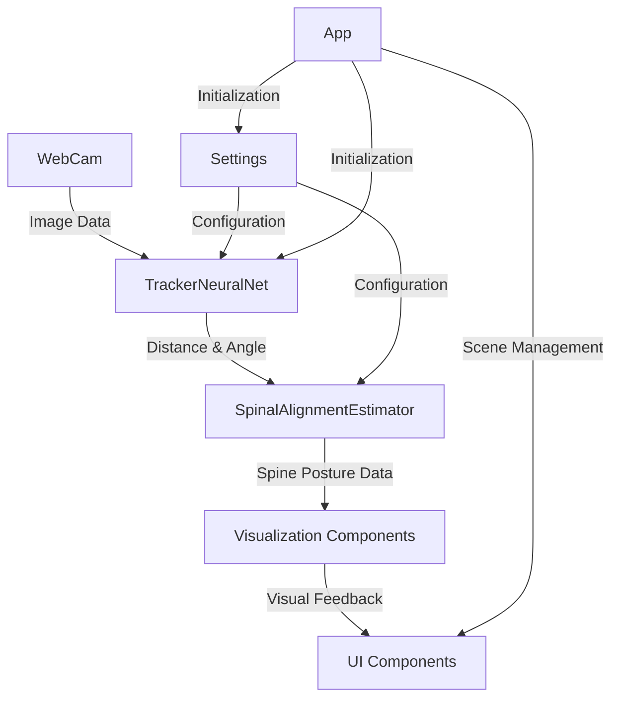

# System Patterns

## System Architecture Overview

Spinometer follows a component-based architecture within the Unity framework, with clear separation of concerns between different functional areas. The system is organized into several key components that work together to provide the complete functionality.

## Core Components and Their Relationships

### 1. App (App.cs)

The central controller that manages:
- Application lifecycle
- Scene loading and transitions
- UI initialization
- State management (Opening, Disclaimer, Running)

The App class serves as the entry point and orchestrator for the entire application, handling the flow between different scenes and ensuring components are initialized in the correct order.

### 2. Face Detection and Tracking (TrackerNeuralNet.cs)

Responsible for:
- Accessing webcam input
- Processing image data using neural networks
- Detecting and tracking faces
- Calculating distance and head angle
- Providing tracking status feedback

This component uses two neural network models:
- Localizer: Detects faces in the webcam feed
- Pose Estimator: Determines the position and orientation of the detected face

### 3. Spinal Alignment Estimation (SpinalAlignmentEstimator)

The core algorithm that:
- Takes distance and angle measurements as input
- Applies proprietary calculations to estimate spinal alignment
- Outputs a SpinalAlignment data structure with relative and absolute angles for different vertebrae

This is the proprietary, patented component that differentiates Spinometer from other posture monitoring solutions.

### 4. Visualization Components

#### 4.1 SpinalAlignmentVisualizerSkeleton

Renders the estimated spine posture using a 3D skeleton model:
- Maps SpinalAlignment data to skeleton bone rotations
- Provides visual feedback on spinal angles
- Supports different visualization modes

#### 4.2 SpinalAlignmentVisualizerStickFigure

Provides an alternative, simplified visualization:
- Renders a 2D stick figure representation of the spine
- Displays angle measurements
- Color-codes angles based on their deviation from ideal values

#### 4.3 VisualizationModeSwitcher

Controls the active visualization mode:
- WebCam only
- Skeleton only
- Stick figure only
- Side by side
- Overlayed

### 5. UI Components

Multiple UI documents for different scenes:
- Opening screen
- Disclaimer
- Settings
- Easy setup screens (camera, angle, distance)
- Main application UI

### 6. Settings Management (Settings.cs)

Handles:
- User preferences
- Calibration data
- Persistence of settings between sessions
- Configuration of algorithm parameters

### 7. Position Controllers

#### 7.1 SkeletonPositionController

Manages the position and animation of the skeleton visualization:
- Handles transitions between focused and unfocused states
- Adjusts positioning based on screen aspect ratio

#### 7.2 WebCamPlanePositionController

Controls the positioning and display of the webcam feed:
- Adjusts based on screen dimensions
- Handles transitions between focused and unfocused states

## Data Flow

1. **Input Capture**: WebCam component captures video frames
2. **Face Detection**: TrackerNeuralNet processes frames to detect and track faces
3. **Measurement Calculation**: Distance and angle are calculated from face position and orientation
4. **Posture Estimation**: SpinalAlignmentEstimator applies algorithm to estimate spine posture
5. **Visualization**: Visualizer components render the estimated posture
6. **UI Update**: UI components display measurements and status information

## State Management

The application uses a simple state machine in the App class:
- **Opening**: Initial splash screen
- **Disclaimer**: Legal disclaimers and information
- **Running**: Normal operation with tracking and visualization

Additional states are managed through scene loading:
- Setup screens (camera selection, angle calibration, distance calibration)
- Settings screen
- Debug and extra UI elements

## Design Patterns in Use

### 1. Component-Based Architecture

Unity's native component system is leveraged throughout the application, with functionality encapsulated in discrete components attached to game objects.

### 2. Observer Pattern

Used for UI updates and data propagation:
- UiDataSource serves as a central data repository
- Components observe changes and update accordingly

### 3. State Pattern

The App class implements a simple state machine to manage application flow.

### 4. Factory Pattern

Scene management uses a factory-like approach to create and initialize UI elements.

### 5. Singleton-like Behavior

While not strict singletons, several components (App, Settings) function as global access points for their functionality.

### 6. Command Pattern

UI interactions use a command-like pattern with button click handlers.

## Key Technical Decisions

1. **Neural Network Models**: Using pre-trained models from the opentrack project for face detection and pose estimation
2. **Unity UI Toolkit**: Modern UI system used for interface elements
3. **Scene-Based Organization**: Functionality divided across multiple Unity scenes
4. **Calibration Workflow**: Three-step process for accurate measurements
5. **Visualization Options**: Multiple visualization modes to suit different user preferences
6. **Localization Support**: Built-in support for multiple languages

## Future Architectural Considerations

To support planned features for background monitoring and data logging, the architecture will need to evolve:

1. **Background Service**: A system for running the application in the background with minimal UI
2. **Data Persistence**: Storage mechanisms for logging posture data over time
3. **Notification System**: Alerts for poor posture when running in the background
4. **Data Analysis**: Components for reviewing and analyzing historical data
5. **Potential Client-Server Architecture**: For remote storage and multi-device access to posture data
